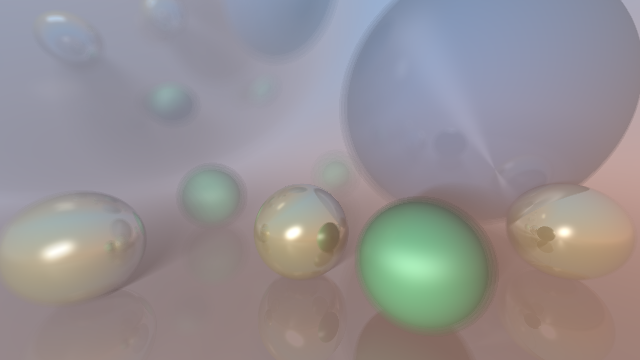
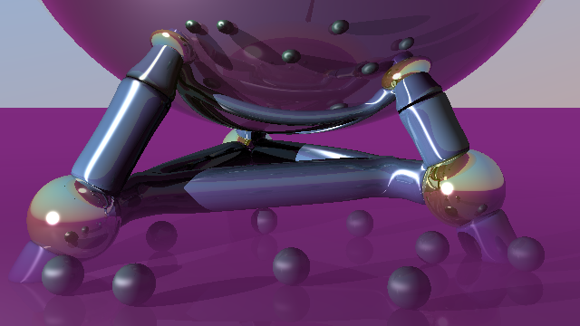
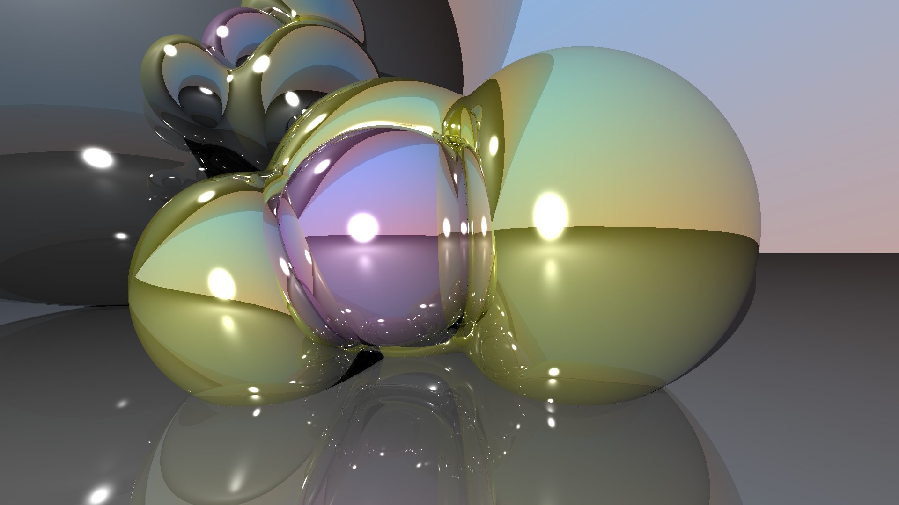
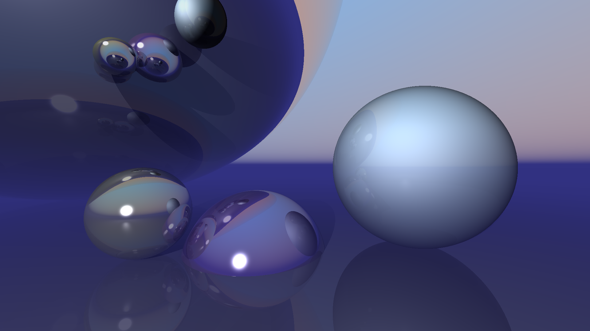
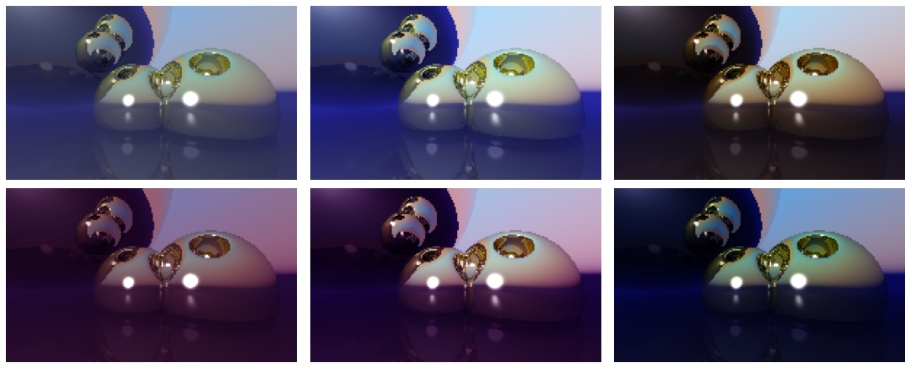

Ray-tracing
=============
Это реализация алгоритма трассировки лучей на python в рамках курса "Компьютерная графика" факультета вычислительной математики и кибернетики (ВМК) Московского государственного университета имени М.В.Ломоносова.

## Реализованные функции и возможности
- Объекты:
  - Потдержка произвольных форм обьктов
    - достаточно знать функцию пересечения луча с объектом, возвращающую расстояние до объекта и нормаль в точке падения луча
  - Класс SDF (signed distance field) объектов с потдержкой CSG (constructive solid geometry)
    - присутствует функция мягкого масимума с произвольным коэфицентом
  - Функция пересечения луча c SDF объектом
- Материал:
  - Микро фасеточная модель бликов с распределением Бекманна
  - Потдержка зависимости от координаты
- Туман:
  - Реализованны конструкторы функций простого и слоистого тумана
    - слоистый туман может быть задан вдоль любого направления
- Камера:
  - Простая смена разрешения снимков камеры
  - Потдержка любой формы диафрагмы
- Сцена:
  - Потдержа произвольного число объктов и точечных источников света
    - в том числе потдерживаются протяжённые источники света произвольного цвета
  - Потдержка наличия тумана
  - Потдержка произвольных функций определения цвета неба
- Пост-эффекты:
  - saturation_effect — усиливает яркие компоенты цвета и уменьшает тусклые
  - sunset_effect — уменьшает вклад зелёного цвета в пользу красного
  - cacao_effect — усиливает контраст и вклад красной составляющей за счёт синей
## Инструкция по запуску/выполнению
Для запуска достаточно запустить RayTracing.ipynb используя сервис colab.research.google.com для чего потребуется воспользоваться адрессом https://github.com/zolotarevd/Ray-tracing.git

По шагам:
- перейти на сайт colab.research.google.com
- в меню открыть вкладку "Файл" -> "Открыть блокнот"
- во вкладке "GitHub" ввести https://github.com/zolotarevd/Ray-tracing.git
- выбрать и запустить RayTracing.ipynb

Или же воспользоваться ссылкой: https://colab.research.google.com/github/zolotarevd/Ray-tracing/blob/main/RayTracing.ipynb

Для выполнения программы последовательно выполните блоки файла (можно воспользоваться сочетание клавишь shift+enter). ВНИМАНИЕ блоки в разделе "Просчитываем сцену" содержат код подключающийся к хранилищу google drive, если вы не хотите сохранять изображение на диск то закоментируйте (с помощью #) строки содержащие drive и "plt.imsave.
## Демонстрация
### Сцена 1

Демонстрирует:
- Простой туман
- Отбрасывание тени на другие объекты
- Зеркальные грани
- Переменная глубина резкости
- Нестандартная нетривиальная модель освещения
- Нечёткие тени за счёт протяжённого источника света

### Сцена 2

Демонстрирует:
- Отбрасывание тени на другие объекты
- Зеркальные грани
- Двумерный пост-эффект
- Слоистый туман
- Нестандартная нетривиальная модель освещения
- CSG (сумарно использовано 17 SDF объектов)

#### До пост-эффекта:

## Бонус)
Немного картинок полученных в процессе разработки

